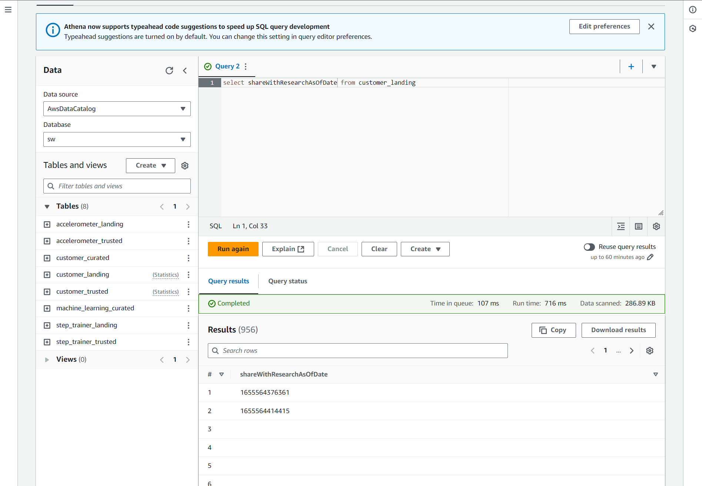

# dend-stedi

All files requested are in the repo root.
Except for Glue ELT jobs which have been exported and the python scripts uploaded to the corresponding folder.

### count_of_customer_landing

### results_of_customer_landing

### count_of_accelerometer_landing

### count_of_step_trainer_landing

### count_of_customer_trusted

### result_of_customer_trusted

### count_of_accelerometer_trusted

### count_of_step_trainer_trusted

### count_of_customer_curated

### count_of_machine_learning_curated

